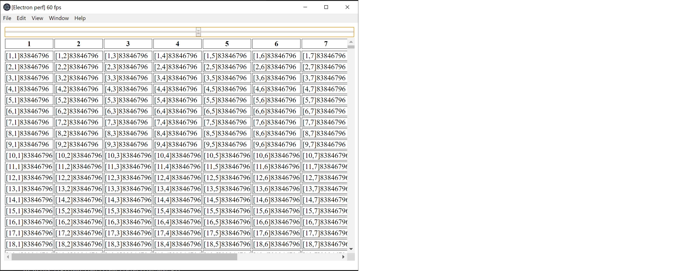

# electron-app

This is demo app, created to show ability manage large table inside electron on 60fps.

## Prerequisites

You will need the following things properly installed on your computer.

* [Git](https://git-scm.com/)
* [Node.js](https://nodejs.org/) (with yarn)

## Installation

* `git clone <repository-url>` this repository
* `cd electron-app`
* `yarn`

## Running / Development

* `yarn electron`

### Running Tests

* `ember test`
* `ember test --server`

### Linting

* `yarn lint:hbs`
* `yarn lint:js`
* `yarn lint:js -- --fix`

### Deploying

Specify what it takes to deploy your app.

## Further Reading / Useful Links

* [ember.js](https://emberjs.com/)
* [ember-electron](https://ember-electron.js.org/)
* [ember-cli](https://ember-cli.com/)
* Development Browser Extensions
  * [ember inspector for chrome](https://chrome.google.com/webstore/detail/ember-inspector/bmdblncegkenkacieihfhpjfppoconhi)
  * [ember inspector for firefox](https://addons.mozilla.org/en-US/firefox/addon/ember-inspector/)
